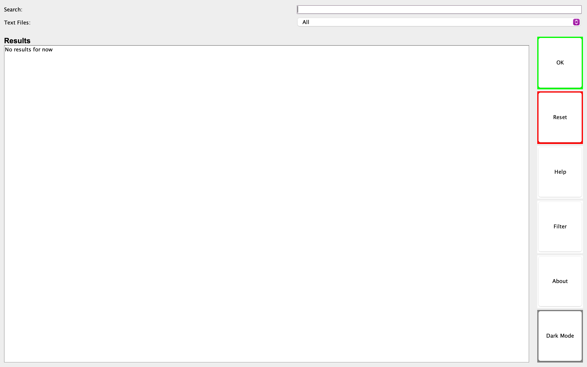
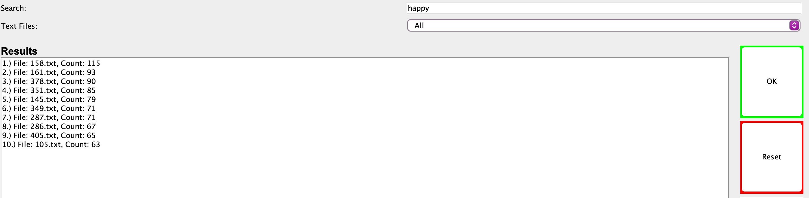
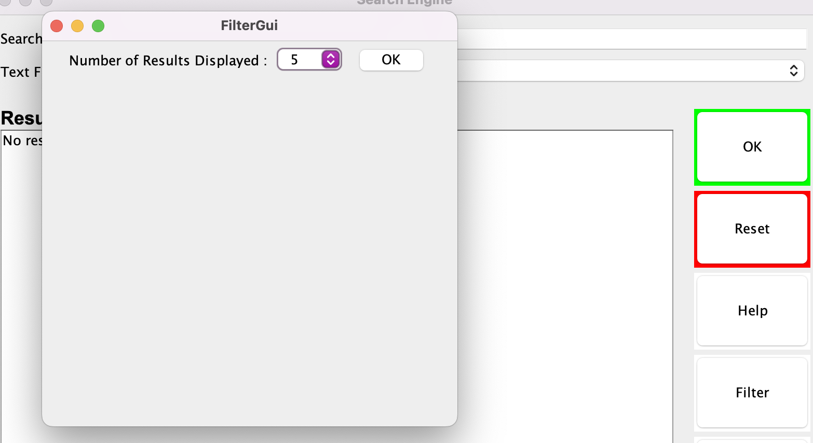
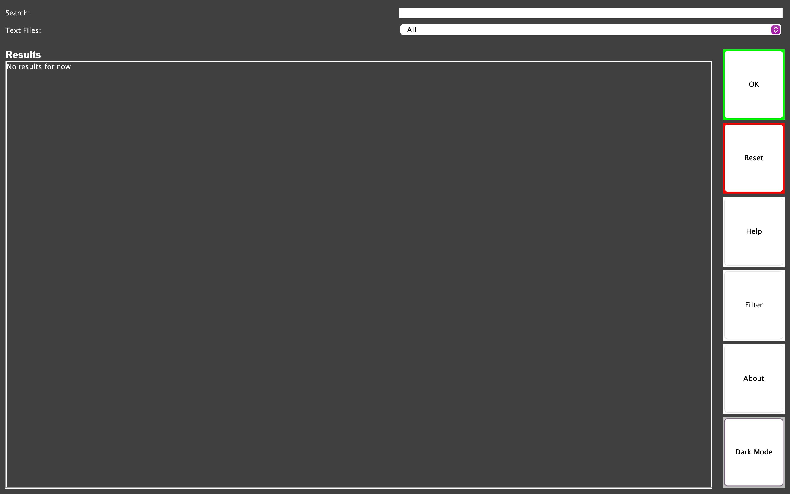
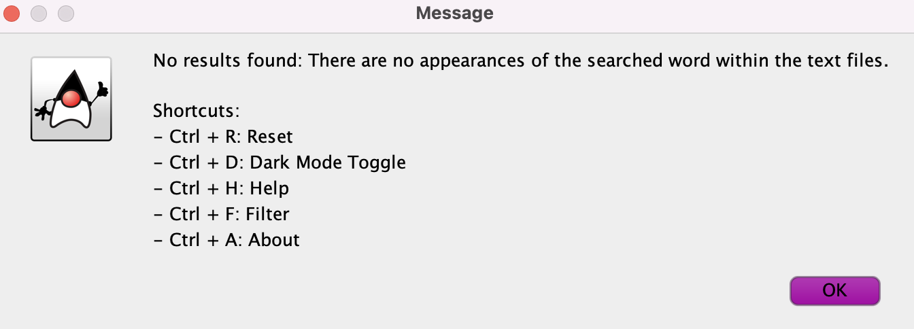

<!DOCTYPE html>
<html lang="en">
<head>
    <meta charset="UTF-8">
    <meta name="viewport" content="width=device-width, initial-scale=1.0">
</head>
<body>

<h1>Java Search Algorithm Project</h1>

<strong>Contributors:</strong> Derry Mahon - C22445282, Niall Heeney - C22410246, Sean Cleary - C22512873, Noah Fahy - C22535923, Patrick Doherty - C22369283

<h2>Java Search Engine GUI</h2>

<h3>Overview</h3>

This Java application provides a graphical user interface for searching text within files stored locally. It allows users to enter a search term, select specific text files, and view search results within the application.

<h3>Features</h3>
<ul>
    <li><strong>Simple Interface:</strong> Easy-to-use graphical interface.</li>
    <li><strong>Search Functionality:</strong> Search for specific words or phrases within text files.</li>
    <li><strong>Filter Options:</strong> Customize search with various filter options.</li>
    <li><strong>Dark Mode:</strong> Switch between standard and dark mode for enhanced visual comfort.</li>
    <li><strong>Helpful Shortcuts:</strong> Keyboard shortcuts for quick access to features like search, reset, dark mode, help, and more.</li>
</ul>

<h4>Simple Interface</h4>

An easy-to-use graphical interface for searching text within files.

<h4>Search Functionality</h4>

Search for specific words or phrases within text files.

<h4>Filter Options</h4>

Customize search with various filter options.

<h4>Dark Mode</h4>

Switch between standard and dark mode for enhanced visual comfort.

<h4>Helpful Shortcuts</h4>

Keyboard shortcuts for quick access to features like search, reset, dark mode, help, and more.

<h3>How to Run</h3>

To run the application, you'll need Java installed on your computer. Follow these steps:

<ol>
    <li>Clone the repository or download the source code.</li>
    <li>Navigate to the directory containing the .java files.</li>
    <li>Compile the code using <code>main.java</code>.</li>
</ol>

</body>
</html>
